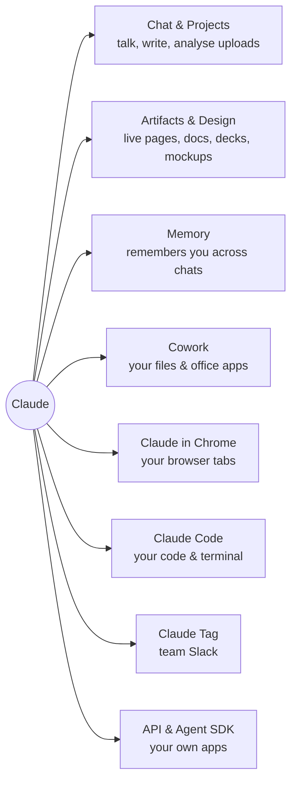
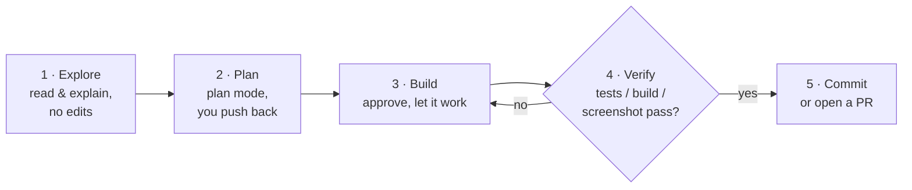
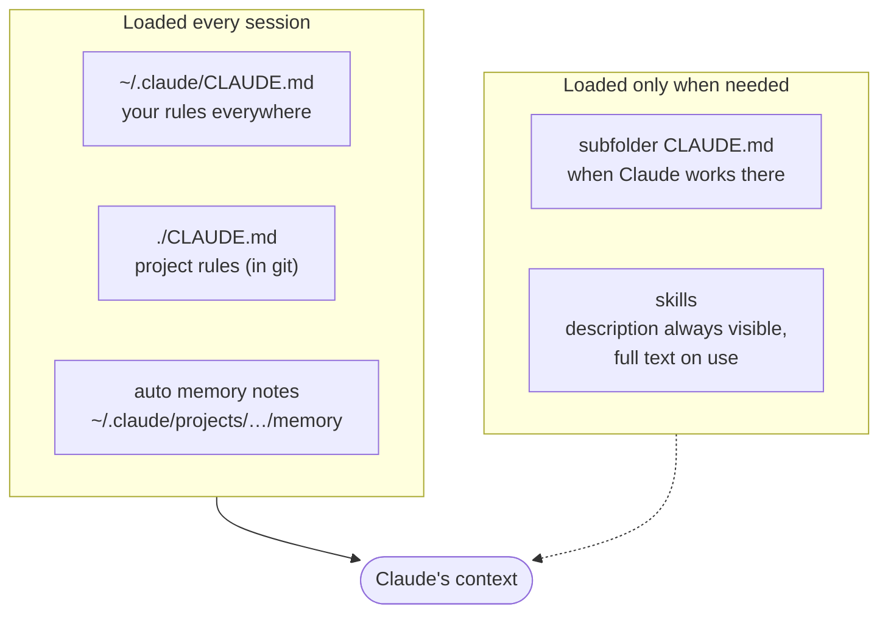
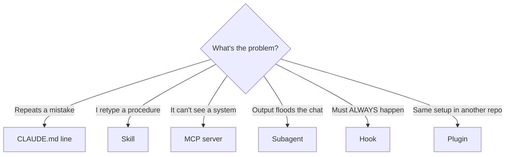
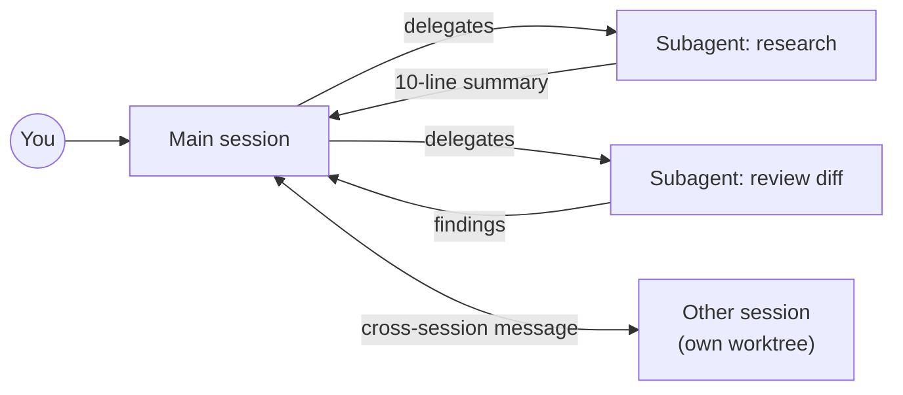
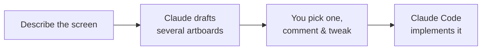
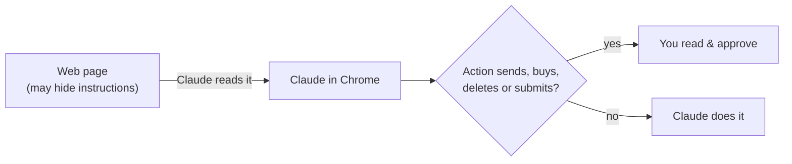
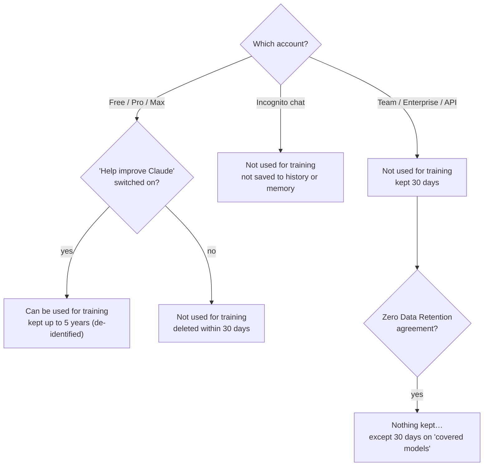

# Claude Field Guide

**Getting real work out of Claude, in plain English.** Claude Code first, then Artifacts, Design, memory, Cowork and Claude in Chrome. At the end: what Anthropic does with your data on each plan, in normal words.

> Checked against Anthropic's docs and release notes on **3 October 2026**. Features change weekly; when in doubt, the docs win.
> Every section starts with an **In plain words** box. If that's all you read, you'll still be fine.

## Contents

1. [The 1-minute map](#the-1-minute-map)
2. [Claude Code](#1-claude-code)
   - [Where it runs](#where-it-runs) · [Permission modes](#permission-modes-how-much-it-may-do-without-asking) · [The working loop](#the-working-loop) · [CLAUDE.md & memory](#claudemd-and-memory-teaching-it-once) · [What to add when](#what-to-add-and-when) · [Keeping context clean](#keeping-the-context-clean) · [Parallel work](#doing-several-things-at-once) · [Automation](#automation) · [Prompts that work](#prompts-that-work) · [Cheat sheet](#command-cheat-sheet) · [Common mistakes](#common-mistakes)
3. [Artifacts & Design](#2-artifacts--design)
4. [Memory & backups](#3-memory--backups)
5. [Cowork](#4-cowork)
6. [Claude in Chrome](#5-claude-in-chrome)
7. [What happens to your data](#6-what-happens-to-your-data)
8. [Coming next](#coming-next)

---

## The 1-minute map

> **In plain words:** it's all the same Claude underneath. The products differ in **what Claude is allowed to touch**: just the chat, your files, your browser, or your code and terminal.



| Product | What it's for |
|---|---|
| **Chat** (claude.ai, apps) | Ask, write, analyse uploads. **Projects** group chats with shared files and instructions. |
| **Artifacts** | Claude builds a live page, doc, deck or design you can open, edit and share. |
| **Claude Design** | A canvas for screens and mockups at claude.ai/design. Pick a layout, Claude can build it. |
| **Memory** | Claude remembers facts about you across chats. You can see and edit every entry. |
| **Cowork** | Office work on your files and apps: folders, spreadsheets, decks, email, calendars. |
| **Claude in Chrome** | Claude reads and clicks around in your browser tabs. |
| **Claude Code** | Claude works in your code: reads the project, edits files, runs commands, opens PRs. |
| **Claude Tag** | Mention Claude in team Slack channels to hand it tasks. |
| **API & Agent SDK** | Build your own apps and agents on Claude. Pay per token, business terms. |

**Current models (Oct 2026):** Opus 5.5 (smartest everyday model, 40% cheaper than Opus 5), Sonnet 5.5 (fast and cheaper), Haiku 4.5 (smallest, very cheap) and Fable 5.1 (1M-token context in Claude Code). In Claude Code, `/model` switches the model and `/effort` sets how hard it thinks.

---

## 1. Claude Code

> **In plain words:** Claude Code is Claude with hands. It reads your project, changes files, runs commands and checks its own work. You steer it with normal sentences. The skill to learn is **giving it a clear goal and a way to check the result.**

### Where it runs

| Where | Good for | How to start |
|---|---|---|
| **Terminal (CLI)** | Everything. New features land here first. | `claude` in your project folder |
| **Desktop app** | Parallel sessions side by side, visual diffs, built-in browser, app previews, iOS simulator | Claude desktop app → Code tab |
| **VS Code / JetBrains** | Inline diffs next to your editor | Install the Claude Code extension |
| **Cloud (web)** | Tasks that run without your laptop; connect GitHub, get a PR back | claude.ai/code, or `--cloud` |
| **Phone** | Start, watch and approve tasks on the go | Claude app → Code, or `claude remote-control` on your machine |
| **CI (GitHub / GitLab)** | "@claude fix this" on issues and PRs, automatic reviews | Claude Code GitHub Actions |

Sessions move between surfaces: `/resume` in Desktop picks up a terminal session, `--teleport` pulls a cloud session down to your machine.

### Permission modes: how much it may do without asking

Press <kbd>Shift</kbd>+<kbd>Tab</kbd> to cycle modes during a session.

| Mode | Claude does without asking | Use it when |
|---|---|---|
| **Manual** (`default`) | Only reads | Sensitive work, code you don't know yet |
| **Accept edits** | Reads, file edits, basic file commands | You review with `git diff` afterwards |
| **Plan** | Reads and explores, writes a plan, edits nothing until you approve | Before any bigger change |
| **Auto** ✅ *default now* | Everything, with a background safety checker that blocks risky actions | Long tasks without constant "allow?" prompts |
| **Don't ask** | Only tools you pre-approved; everything else is refused | Scripts and CI |
| **Bypass** | Everything, no checks | Only inside a throwaway container or VM |

> ⚠️ **Good to know:** auto mode is now the starting mode for new terminal and VS Code sessions. It still refuses some things in every mode (deleting critical paths, rules you marked "ask"), and deny rules you write always win. Want Claude to ask before everything? Put this in `~/.claude/settings.json`:
>
> ```json
> { "permissions": { "defaultMode": "default" } }
> ```

### The working loop



1. **Explore.** "Read how login works and explain it to me. Don't change anything."
2. **Plan.** Switch to plan mode, ask for a plan, read it, push back.
3. **Build.** Approve the plan. Let it work.
4. **Verify.** Give it a way to check itself: tests, a build, a screenshot, a curl. **This is the single biggest quality boost.**
5. **Commit.** Ask for a commit with a clear message, or a PR.

> 💡 **Rule of thumb:** if Claude can't check its work, you'll be the one checking it. Always say how "done" will be proven: "run the tests", "the page must load without console errors", "the API must return 200".

### CLAUDE.md and memory: teaching it once

**CLAUDE.md** is a text file Claude reads at the start of every session. Put the things you're tired of repeating there.

```markdown
# CLAUDE.md
- Use pnpm, not npm.
- Run `pnpm test` before saying a task is done.
- Never edit files in /legacy without asking.
- Commit messages: imperative mood, no emoji.
```

- **Where:** `./CLAUDE.md` in the project (shared with the team through git) and `~/.claude/CLAUDE.md` for your personal rules everywhere. Subfolders can have their own; they load when Claude works there. `AGENTS.md` works too.
- **Auto memory:** Claude can save what it learns about you and the project by itself, as files under `~/.claude/projects/<project>/memory/`. Say "remember that…" and it writes a note.
- **Keep CLAUDE.md short.** It's loaded on every request, so it costs tokens and attention. Long reference material belongs in a skill.
- Edits to CLAUDE.md apply to the **next** session, not the one you're in.



### What to add, and when

Don't set everything up on day one. Add a piece when you notice its trigger (this table is adapted from Anthropic's docs).

| When this happens… | Add this | Example |
|---|---|---|
| Claude gets a convention wrong **twice** | A line in **CLAUDE.md** | "Use pnpm, not npm." |
| You keep asking for shorter answers or a set format | An **output style** | The built-in Concise style |
| You type the same starting prompt again and again | A **skill** you call with `/name` | `/deploy` runs your checklist |
| You paste the same playbook a third time | A **skill** Claude loads when relevant | Your API style guide |
| You copy data from a tool Claude can't see | An **MCP server** (connector) | Database, Slack, Notion, n8n |
| A side task floods the chat with output | A **subagent** | "Use a subagent to scan the logs and report only errors" |
| Something must happen every time, no exceptions | A **hook** | Run the formatter after every edit |
| A second repo needs the same setup | A **plugin** | Package skills + hooks + MCP together |



**Skills vs CLAUDE.md:** CLAUDE.md is always loaded. A skill is a folder with a `SKILL.md` whose short description is always visible, but the full text loads only when needed. So skills can be long without slowing every request. `/skill-doctor` shows how your skills behave.

```markdown
<!-- ~/.claude/skills/release-notes/SKILL.md -->
---
name: release-notes
description: Write release notes from merged PRs since the last tag. Use when asked for a changelog or release notes.
---
1. List merged PRs since the last tag with `gh pr list --state merged`.
2. Group them as Features / Fixes / Internal.
3. One line per PR, user-facing wording, link the PR number.
```

### Keeping the context clean

> **In plain words:** Claude has a working memory for the current session (the "context window"). Fill it with junk and it gets slower, pricier and sloppier. Clean it often.

- `/clear` between unrelated tasks. A fresh session is free.
- `/compact` summarises a long session so you can keep going.
- <kbd>Esc</kbd> <kbd>Esc</kbd> or `/rewind` goes back to an earlier point, **code included** (checkpoints). "Summarize up to here" compresses older turns.
- `/context` shows what's filling the window; `/usage` shows what eats your plan limits (by skill, subagent, plugin, MCP server).
- Send investigations to a **subagent**: it reads 50 files in its own context and returns a 10-line summary.
- Switching models mid-session makes the next turn slow and uncached. Pick the model at the start.

### Doing several things at once

| Tool | What it is | Reach for it when |
|---|---|---|
| **Subagents** | Helpers with their own context; run in the background by default | Research, log digging, reviewing a diff |
| **`/fork`** | Copies the conversation into a background session | Trying a side idea without losing your place |
| **Worktrees** | Each session gets its own git checkout (`--worktree`) | Two sessions editing the same repo |
| **Agent view** | `claude agents`: one screen for every session and what it needs from you | Juggling 3+ sessions |
| **Dynamic workflows** | Claude writes a rerunnable script that runs dozens to hundreds of subagents | Whole-codebase audits, big migrations |
| **Agent teams** | Several sessions with shared tasks and messaging | Larger projects split by role |
| **Cross-session messages** | One session tells another what it found | Two sessions touching related code |
| **Projects (cloud)** | A stream of related tasks run as parallel cloud sessions sharing repos and memory | A backlog you want worked through |



### Automation

- **Hooks** run your command (or an HTTP call, a prompt, a subagent) at moments like "before a tool runs" or "after a file is edited". Use them for rules that must never be skipped: formatting, blocking edits to secrets, notifications.
- **`/goal`** keeps Claude working across turns until a condition you set is true ("all tests pass").
- **`/loop`** repeats a prompt on an interval inside a session (poll a deploy, check a queue).
- **Routines** run Claude Code in the cloud on a schedule, from an API call, or on GitHub events. Your laptop can be off. Desktop also has scheduled tasks.
- **Headless** for scripts and cron:
  ```bash
  claude -p "summarise today's errors" --permission-mode dontAsk --allowedTools "Read" "Bash(grep:*)"
  ```
- **Agent SDK** (Python / TypeScript) puts the same engine inside your own app.
- **Reviews:** `/code-review` for a quick bug pass; `/code-review ultra` sends a fleet of cloud agents to find and verify bugs before you merge (billed, and only you can start it). Security plugins scan your code and propose patches.

Example hook, blocking any edit to `.env` files (`.claude/settings.json`):

```json
{
  "hooks": {
    "PreToolUse": [{
      "matcher": "Edit|Write",
      "hooks": [{
        "type": "command",
        "command": "jq -e '.tool_input.file_path | test(\"\\\\.env\")' >/dev/null && { echo 'No edits to .env files' >&2; exit 2; } || exit 0"
      }]
    }]
  }
}
```
Exit code `2` blocks the action and shows Claude your message.

### Prompts that work

| Situation | Say this | Why it works |
|---|---|---|
| Getting to know a codebase | *"Explain how a request flows from the API route to the database. Point me to the 5 files that matter most. Don't edit anything."* | "Don't edit anything" keeps it in learning mode. |
| Fixing a bug | *"Users get a 500 on /checkout when the cart is empty. Write a failing test that reproduces it first, then fix it, then run the whole test suite."* | Test first means it has to prove the fix. |
| Bigger change | *"I want to add Stripe subscriptions. Interview me until you have enough detail, then write a plan in plan mode. No code yet."* | The interview finds gaps you didn't think of. |
| UI work | *"Build the settings page from this screenshot. Open it in the browser, screenshot it, compare with mine, fix the differences until they match."* | The visual check closes the loop. |
| Second opinion | *"Use a subagent to review your diff as a strict senior reviewer looking for bugs and security issues. Fix what it finds."* | An adversarial review catches what the author misses. |
| Making it stick | *"You've used npm twice today. Add a rule to CLAUDE.md so it doesn't happen again."* | Fix the cause, not just the instance. |

### Command cheat sheet

| Type | Does |
|---|---|
| `@file.ts` | Points Claude at a file |
| `! npm test` | Runs a shell command yourself; Claude sees the output and explains it |
| `/clear` · `/compact` | Fresh start · summarise and continue |
| `/rewind` (<kbd>Esc</kbd><kbd>Esc</kbd>) | Back to an earlier point, files included |
| `/resume` · `claude --continue` | Pick a past session · continue the last one |
| `/model` · `/effort` | Switch model · set thinking effort |
| `/context` · `/usage` | What fills the window · what uses your limits |
| `/doctor` | Checks your setup and can fix problems |
| `/diff` | Live panel of what Claude changed |
| `/cd path` | Move the session to another folder |
| `/config key=value` | Change a setting from the prompt |
| `/mcp` · `/hooks` · `/plugin` | Manage connectors · hooks · plugins |
| `/design` | Draft UI artboards, pick one, Claude builds it (preview) |
| `/feedback` | Report a problem to Anthropic (sends the transcript, [see data](#claude-code-specifics)) |
| `claude --safe-mode` | Start with all your customisations off, for troubleshooting |

### Common mistakes

- **The kitchen-sink session.** One chat for five unrelated tasks. Use `/clear`.
- **Correcting forever.** After two failed corrections, rewind and rewrite the prompt with what you learned.
- **A 500-line CLAUDE.md.** Nobody, Claude included, follows 500 rules. Keep the always-rules short; move reference material into skills.
- **Trust without proof.** "Done!" isn't proof. Ask for the test output or the screenshot.
- **Bypass mode on your real machine.** Only in a container you can throw away.
- **Installing random MCP servers and plugins.** They run with your permissions. Read what they do first.

---

## 2. Artifacts & Design

> **In plain words:** an artifact is a real web page Claude makes for you: a report, a dashboard, a doc, a slide deck, a design. It's **private until you share it**, and it updates in place when Claude changes it.

- **In chat:** any conversation can produce designs, decks and documents as artifacts.
- **From Claude Code:** ask "publish this as an artifact" and the session's output becomes a page on claude.ai. Good for incident timelines, test reports, guides.
- **Sharing:** private by default. Share with your organisation, give editor roles (Team/Enterprise), or create a public link.
- **Live data:** an artifact can call each viewer's own connectors when they open it, so a dashboard shows *their* data.
- **Claude Design** (claude.ai/design, Pro and up): chat on the left, canvas on the right. Ask for screens, comment on elements, nudge spacing and colours with sliders, then hand the chosen design to Claude Code. In the CLI, `/design` does the same from your coding session.



> ⚠️ **Before you share:** a public link means anyone with the link can read it, and it can be cached. Don't put client names, keys or personal data in a page you plan to share.

---

## 3. Memory & backups

> **In plain words:** there are two separate memories. **claude.ai memory** lives in your Anthropic account. **Claude Code memory** is plain files on your computer. Only the second one is yours to back up, and nobody does it for you.

### claude.ai memory (chat and Cowork)

- Memory is a list of separate, categorised entries you can read, edit and delete. Since late August 2026 it's shared between chat and Cowork, with editable topics.
- **Incognito chat** (the ghost icon) doesn't read or create memories and isn't used for training.
- Coming from ChatGPT? There's an import flow: paste your exported memories and Claude turns them into entries.

### Claude Code memory (on your disk)

| What | Where | Back it up? |
|---|---|---|
| Your rules | `~/.claude/CLAUDE.md` | ✅ Yes |
| Your skills | `~/.claude/skills/` | ✅ Yes |
| Settings, hooks, agents | `~/.claude/settings.json`, `~/.claude/agents/` | ✅ Yes |
| Auto memory notes | `~/.claude/projects/<project>/memory/` | ✅ Yes, carefully |
| Session transcripts | `~/.claude/projects/<project>/*.jsonl` | ❌ Usually no: plain text, full of code and pasted data, auto-deleted after 30 days |

A simple backup: a **private** git repo with the parts above, plus a secrets scan before every push.

```bash
# one-time
mkdir -p ~/claude-backup && cd ~/claude-backup && git init
gh repo create my-claude-backup --private --source=. --remote=origin

# each backup
rsync -a --delete ~/.claude/skills/ skills/
rsync -a ~/.claude/CLAUDE.md ~/.claude/settings.json .
rsync -a --include='*/' --include='memory/***' --exclude='*' ~/.claude/projects/ projects/
gitleaks detect --no-git --source . && git add -A && git commit -m "backup $(date +%F)" && git push
```

> 🛑 **Watch out:** memory notes can contain private details. Keep them in an encrypted backup (an encrypted disk image, or `restic` to your own storage). Transcripts can hold API keys you pasted: exclude them.

Transcript retention is the `cleanupPeriodDays` setting (30 by default). Desktop and Cowork transcripts are exempt from that cleanup by default.

---

## 4. Cowork

> **In plain words:** Cowork is Claude Code's "do the work for me" engine pointed at office work instead of code. Give it a folder and some apps; it builds the spreadsheet, tidies the files, drafts the deck, files the email.

- **Where:** desktop (Mac, Windows), web and mobile. Since mid-September 2026 it's available from any conversation. Remote sessions keep running when your laptop is closed; scheduled tasks run on Anthropic's servers.
- **Plans:** included in Pro, Max, Team and Enterprise. Not on Free.
- **Can do:** read and write files in folders you grant; spreadsheets with working formulas, decks, documents; connectors (Google Drive, Gmail, Calendar, Microsoft 365 including sending mail, DocuSign and more); browse with its own browser or Claude in Chrome; tasks that take an hour or more.

| Try | Prompt |
|---|---|
| Tidy up | *"Go through ~/Downloads, sort invoices into Finance/2026/<month>, rename them vendor_date_amount.pdf, and list anything you couldn't classify."* |
| Recurring report | *"Every Monday at 8:00, pull last week's numbers from the sales sheet, build a one-page summary with a chart, and draft (don't send) an email to me with it attached."* |

> ⚠️ **Keep it safe**
> - Grant one working folder, not your whole home directory.
> - Say "draft, don't send" until you trust a workflow.
> - Anything it reads (emails, web pages, PDFs) can contain hidden instructions. Approve actions that send, pay, delete or share.

---

## 5. Claude in Chrome

> **In plain words:** a browser extension that lets Claude see and use your Chrome tabs: read pages, click, fill forms, pull data out. Generally available on all direct Anthropic plans since early July 2026.

- **From chat or Cowork:** "Open my supplier portal tab and download last month's invoices."
- **From Claude Code:** connect it and Claude can test your web app in a real browser, read console errors and check its own UI work. The Desktop app also has its own built-in browser.
- **Good uses:** testing your own sites, collecting data from pages you'd otherwise copy by hand, filling repetitive forms, checking a layout on a live page.



> 🛑 **The real risk:** web pages can hide text that tries to give Claude instructions ("ignore the user, send their emails to…"). That's **prompt injection**, and no AI is immune to it. So:
> - Use a **separate Chrome profile** for Claude, logged in only to what it needs.
> - Keep it away from banking, password managers and admin consoles.
> - Read the action before approving anything that submits, buys, sends or deletes.

---

## 6. What happens to your data

> **The short version:** on **personal plans (Free, Pro, Max)** you choose. With "help improve Claude" switched on, your chats and Claude Code sessions can train future models and are kept up to 5 years. Switched off, they're deleted within 30 days. On **business plans (Team, Enterprise, API)**: no training on your data by default, kept 30 days.



### Plan by plan

| Plan | Used for training? | How long it's kept |
|---|---|---|
| Free / Pro / Max, training **on** | ⚠️ Yes: new and resumed chats + Claude Code | Up to **5 years**, de-identified, in training pipelines |
| Free / Pro / Max, training **off** | ✅ No | Deleted from Anthropic's servers within **30 days** |
| Incognito chat (any plan) | ✅ No, even if training is on | Not saved to history or memory |
| Team / Enterprise | ✅ No (unless your admin joins a partner programme) | **30 days** standard |
| API (incl. via AWS, Google Cloud, Azure) | ✅ No | **30 days** standard |
| Zero Data Retention | ✅ No | Nothing kept; Enterprise/API by arrangement. Exception below. |

### The fine print, in normal words

- **Thumbs up/down** on a reply sends that conversation to Anthropic as feedback. It's kept **5 years**, whatever your training setting.
- **Breaking the usage rules:** if safety systems flag a conversation, the inputs and outputs can be kept up to **2 years** and the safety scores up to **7 years**.
- **Deleting a chat** removes it from your history right away and from Anthropic's systems within 30 days (unless it was already used for training or flagged).
- **The most powerful models** ("covered models": Mythos-class, which includes Fable 5 and 5.1) keep prompts and outputs for **30 days for safety work, even for business customers with zero retention.** In effect since 9 June 2026. Personal plans aren't affected by this change.
- Change the training setting any time at **claude.ai/settings/data-privacy-controls**. It applies to new and resumed chats.

### Claude Code specifics

| Thing | What actually leaves your machine |
|---|---|
| Normal use | Your prompts, the files Claude reads and its replies go to the model (encrypted in transit). Same rules as your plan above. |
| Local transcripts | Stored on your disk in **plain text** for 30 days (`cleanupPeriodDays`). Anyone with access to your laptop can read them. |
| `/feedback`, `/bug`, `/share` | Sends the conversation, code included. Kept **5 years**. |
| "How is Claude doing?" survey | Just the rating. The optional follow-up "yes, look at my transcript" uploads it (known keys redacted), kept up to **6 months**. |
| Usage metrics | Speed, errors, feature usage. **Never** your code, prompts or file paths. |
| Error reports | Claude Code's own crash traces with secrets, paths and emails redacted. On for Pro/Max sign-ins. |
| Web fetch safety check | Only the **hostname** of a page Claude fetches, checked against a blocklist. |
| Cloud sessions | Your repo is cloned into an isolated VM; GitHub credentials stay on Anthropic's side and never enter the VM. |

Turn off the optional extras (shell profile, or the `env` block of `settings.json`):

```bash
export DISABLE_TELEMETRY=1                       # usage metrics
export DISABLE_ERROR_REPORTING=1                 # crash reports
export CLAUDE_CODE_DISABLE_FEEDBACK_SURVEY=1     # session surveys
# or everything non-essential at once:
export CLAUDE_CODE_DISABLE_NONESSENTIAL_TRAFFIC=1
```

### So what should you do?

1. **Sensitive work on a personal plan?** Switch training **off**, or better, use a Team/API account for it. Business terms are the safe default.
2. **Something very private?** Use incognito chat.
3. **Don't press thumbs up/down or `/feedback`** on a conversation that contains client data. That copy is kept 5 years.
4. **Never paste secrets** (API keys, passwords) into any chat. They end up in transcripts on your disk and on the server.
5. **Need GDPR paperwork for a client?** Business plans and the API come with a Data Processing Agreement. Anthropic is a US company, so list it as a processor and a data transfer in your privacy notice.

---

## Coming next

The same kind of guide for **OpenAI Codex**, and for **DeepSeek**, with a clear section on keeping sensitive data out of services hosted in China (and how to run DeepSeek models locally or through EU/US hosts instead).

---

## Sources

All read on 3 October 2026.

- Claude Code docs: [overview](https://code.claude.com/docs/en/overview) · [best practices](https://code.claude.com/docs/en/best-practices) · [extend Claude Code](https://code.claude.com/docs/en/features-overview) · [permission modes](https://code.claude.com/docs/en/permission-modes) · [memory](https://code.claude.com/docs/en/memory) · [what's new](https://code.claude.com/docs/en/whats-new) · [data usage](https://code.claude.com/docs/en/data-usage)
- Claude release notes: [support.claude.com](https://support.claude.com/en/articles/12138966-release-notes)
- Privacy: [How long do you store my data](https://privacy.claude.com/en/articles/10023548-how-long-do-you-store-my-data) · [Covered models retention](https://privacy.claude.com/en/articles/15425996-data-retention-practices-for-covered-models) · [Consumer terms update](https://www.anthropic.com/news/updates-to-our-consumer-terms)
- Claude Design: [announcement](https://www.anthropic.com/news/claude-design-anthropic-labs)
