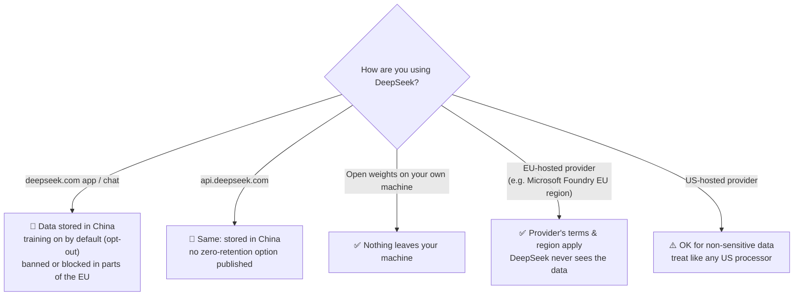
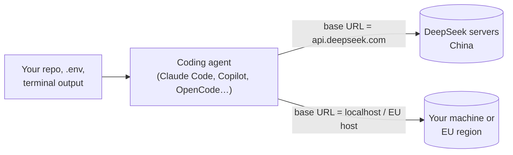

# DeepSeek Field Guide

**Using DeepSeek without sending your secrets to China.** What DeepSeek is, why it's tempting (cheap, strong, open weights), where your data goes on each way of using it, and how to get the model's benefits while keeping sensitive data in the EU or on your own machine.

> Checked against DeepSeek's own docs and privacy policy, EU regulator actions and NIST's evaluation on **3 October 2026**. Not legal advice.
> Every section starts with an **In plain words** box. If that's all you read, you'll still be fine.

## Contents

1. [The 30-second version](#the-30-second-version)
2. [What DeepSeek is](#what-deepseek-is)
3. [Where your data goes](#where-your-data-goes-pick-the-right-door)
4. [The China problem, in plain words](#the-china-problem-in-plain-words)
5. [Safe ways to use it](#safe-ways-to-use-it)
6. [Using DeepSeek from coding agents](#using-deepseek-from-coding-agents)
7. [Model quality and safety caveats](#model-quality-and-safety-caveats)
8. [Decision checklist](#decision-checklist)

---

## The 30-second version

> 🛑 **Never send personal data, credentials, sensitive code or anything you'd mind a foreign government reading to DeepSeek's own app or API.** That data is stored in China, can be used for training by default, and EU regulators have already ruled the transfers unlawful.
>
> ✅ **You can still use the model.** DeepSeek's models are open weights (MIT licence). Run them **on your own hardware** or through an **EU-hosted provider** (for example Microsoft Foundry in Poland Central or West Europe). Then your data never touches DeepSeek's servers.



---

## What DeepSeek is

> **In plain words:** a Chinese AI lab (Hangzhou) making strong models at very low prices, and publishing the model weights so anyone can run them.

| Model (Oct 2026) | API name | Context | Notes |
|---|---|---|---|
| **DeepSeek-V4.1-Flash** | `deepseek-flash` | 1M tokens | Fast and cheap, thinking and non-thinking modes, vision. Open weights (~760B parameters, MIT). |
| **DeepSeek-V4-Pro** | `deepseek-v4-pro` | 1M tokens | Bigger and stronger, no vision. Open weights (~1.6T parameters, MIT). |
| DeepSeek-R1 distills | (local) | — | Small reasoning models (1.5B–70B) built on Qwen/Llama bases. These are the ones that run on a laptop or a single GPU. |

**Price** on DeepSeek's own API (per million tokens, peak hours; off-peak is half): Flash $0.30 input / $1.20 output, Pro $1.32 / $3.96, and cache hits are a few cents. That's a fraction of US frontier prices, which is exactly why people are tempted.

The API speaks both **OpenAI** (`https://api.deepseek.com`) and **Anthropic** (`https://api.deepseek.com/anthropic`) formats, so it plugs into most tools by changing a base URL. Convenient, and also how data ends up in China without anyone noticing. See [coding agents](#using-deepseek-from-coding-agents).

---

## Where your data goes: pick the right door

| Way of using it | Where data is processed and stored | Used for training? | Verdict for EU / client work |
|---|---|---|---|
| **deepseek.com chat, mobile app** | **People's Republic of China** | Yes by default; you can opt out | 🛑 No |
| **DeepSeek API** (`api.deepseek.com`) | **China** | Default on, policy-level opt-out; no API carve-out, no published zero-retention tier | 🛑 No |
| **Tools pointed at DeepSeek's API** (Claude Code, Copilot, OpenCode, n8n "OpenAI-compatible" nodes…) | **China**: everything the tool sends (your code, files, prompts) | As above | 🛑 No |
| **Open weights, self-hosted** (Ollama, llama.cpp, vLLM on your server) | **Your machine** | No | ✅ Yes |
| **EU cloud provider** (e.g. Microsoft Foundry, V4-Flash in EU regions incl. Poland Central) | **EU region** of that provider; provider's DPA | Per provider's terms (Azure: no training on customer data) | ✅ Yes, with a DPA |
| **US cloud provider** (Azure global, AWS Bedrock US, Together, Fireworks…) | US | Per provider | ⚠️ Fine for non-sensitive data; standard US-processor paperwork |

> ⚠️ **Watch the region, not just the brand.** On Microsoft Foundry, **V4-Flash** is offered in EU data zones; **V4-Pro** was **Global Standard only** (no EU data zone) at the time of writing. "Hosted on Azure" doesn't automatically mean "in the EU".

---

## The China problem, in plain words

> **In plain words:** it's not about DeepSeek being evil. It's that data stored in China falls under Chinese law, EU law says you can't send personal data there without safeguards that don't exist, and two EU regulators have already acted.

- **DeepSeek's own policy** (updated 10 Feb 2026): *"we directly collect, process and store your Personal Data in People's Republic of China."* That covers text and voice input, prompts, uploaded files, photos, feedback, chat history, device model, IP address and device IDs. Retention is "as long as necessary". They may share data with law enforcement "to comply with applicable law".
- **Chinese law:** organisations can be required to support and cooperate with state intelligence work (National Intelligence Law, Art. 7). You can't contract your way out of that.
- **GDPR:** China has **no adequacy decision**, and DeepSeek offers no Standard Contractual Clauses. Sending EU personal data there is an unlawful transfer, and the liability sits with **you** as controller, not just with DeepSeek.
- **Regulators so far:**
  - 🇮🇹 **Italy** (Garante) blocked DeepSeek from processing Italian users' data in January 2025 and opened an investigation.
  - 🇩🇪 **Germany** (Berlin DPA) reported the app to Apple and Google as illegal content in June 2025, after DeepSeek ignored requests to stop transfers.
  - 🇮🇪 **Ireland** opened an inquiry. 🇳🇱 Netherlands and others banned it on government devices. South Korea, Australia, Taiwan and several US agencies restricted it too.
- **Security track record:** in January 2025 researchers (Wiz) found a publicly exposed DeepSeek database containing chat histories and API keys. It was closed quickly, but it tells you something about maturity.

---

## Safe ways to use it

### 1. Run it locally (nothing leaves your machine)

```bash
# Ollama: small distilled reasoning models that fit on a laptop / one GPU
ollama pull deepseek-r1:8b        # ~5 GB, fine on a modern laptop
ollama pull deepseek-r1:32b       # needs a strong GPU or lots of RAM
ollama run deepseek-r1:8b
```

```python
# Ollama exposes an OpenAI-compatible API on localhost
from openai import OpenAI
client = OpenAI(base_url="http://localhost:11434/v1", api_key="ollama")   # key is ignored locally
r = client.chat.completions.create(
    model="deepseek-r1:8b",
    messages=[{"role": "user", "content": "Summarise this contract clause: ..."}],
)
print(r.choices[0].message.content)
```

- The full V4-Flash and V4-Pro are far too big for a laptop (hundreds of billions of parameters). Run them with vLLM/SGLang on your own GPU servers, or use an EU host.
- **Check the Ollama tag is actually local.** Some catalog entries are cloud-backed or retired (the `deepseek-v4-flash` Ollama entry was retired on 27 Aug 2026). If a model runs "in the cloud", your data leaves the machine.
- Pair with a **PII mask** before any hosted call anyway (see the `local-llm-ollama` and `decision-model-guards` skills in [ai-engineering-toolkit](https://github.com/Eugene-WebDev/ai-engineering-toolkit) / [ai-security-toolkit](https://github.com/Eugene-WebDev/ai-security-toolkit)).

### 2. Use an EU-hosted provider

- **Microsoft Foundry:** DeepSeek V4 Flash and V4 Pro are in the catalog. Pick a deployment in an **EU data zone** (V4-Flash: France Central, Germany West Central, Italy North, **Poland Central**, Spain Central, Sweden Central, West Europe). Your contract is with Microsoft (DPA, EU data boundary), and DeepSeek the company never sees your prompts.
- Check other EU providers' catalogs (OVHcloud, Scaleway, IONOS, etc.) for current DeepSeek models and regions. Catalogs change monthly.
- Confirm in writing: region, retention, no training, DPA. Same checklist as any processor.

### 3. If you must use DeepSeek's own service

Only for **public, non-personal, non-confidential** content (rewording a public blog post, trying the model out):
- Opt out of training in settings.
- Use a separate account with no real name or work email.
- Never connect it to your email, drive, repos or company tools.
- Assume everything you type is kept and readable.

---

## Using DeepSeek from coding agents

> 🛑 **This is the easiest way to leak a whole codebase to China by accident.** DeepSeek's docs actively promote using it as the backend for Claude Code, GitHub Copilot and OpenCode, through its Anthropic- and OpenAI-compatible endpoints. A coding agent sends **every file it reads**, your terminal output and often your `.env` contents to the model.



Rules:
- **Sensitive repos:** never point an agent at `api.deepseek.com`.
- **Check your environment** for redirected base URLs before starting an agent on a sensitive repo:
  ```bash
  env | grep -iE 'ANTHROPIC_BASE_URL|OPENAI_BASE_URL|OPENAI_API_BASE|deepseek'
  ```
- Want DeepSeek in your agent for cost reasons? Point the base URL at **your own vLLM/Ollama server** or an **EU-hosted endpoint** instead.
- Same for n8n / Make / Zapier: an "OpenAI-compatible" node with a DeepSeek base URL sends every workflow item to China.

---

## Model quality and safety caveats

Even when hosted safely, keep these in mind (NIST's Center for AI Standards and Innovation evaluation, 30 Sep 2025, of DeepSeek models up to V3.1):

- **Easier to hijack:** agents built on DeepSeek were on average **12× more likely to follow malicious instructions** hidden in content (prompt injection) than US frontier models. Use strict tool permissions, approval gates and no lethal trifecta (see the `ai-agent-security` skill).
- **Easier to jailbreak:** with well-known jailbreak techniques the models helped with most of the harmful requests tested.
- **Censorship and political alignment:** answers on topics sensitive to the Chinese government are filtered or slanted, in English as well as Chinese, and this is partly baked into the open weights. Don't use it for research or content where that matters.
- **Benchmarks:** at the time, the best US models were ahead, especially on software-engineering and cyber tasks. Newer V4 models narrowed gaps; test on your own tasks rather than trusting leaderboards.

---

## Decision checklist

| Question | If yes |
|---|---|
| Does the input contain personal data (names, emails, customer records)? | Local or EU-hosted only. Never DeepSeek's API or app. |
| Is it sensitive code, private material or credentials? | Local or EU-hosted only, and mask secrets first. |
| Is it an agent with tools (email, files, web, payments)? | Prefer a model with stronger injection resistance; if DeepSeek, lock tools down and require approvals. |
| Is the content politically or historically sensitive? | Don't rely on DeepSeek's answers. |
| Is it public text and you just want cheap tokens? | DeepSeek's API is OK. Opt out of training, use a throwaway account. |
| Do you need it for a client project in the EU? | EU-hosted deployment + provider DPA + note it in the DPIA. Mention the model's origin to the client. |

---

## Sources

All read on 3 October 2026.

- DeepSeek: [API docs: first call](https://api-docs.deepseek.com/) · [Models & pricing](https://api-docs.deepseek.com/quick_start/pricing) · [Privacy policy (10 Feb 2026)](https://cdn.deepseek.com/policies/en-US/deepseek-privacy-policy.html) · [Model weights on Hugging Face](https://huggingface.co/deepseek-ai)
- Regulators: [Italy blocks DeepSeek (HIMSS)](https://www.himss.org/news-center/deepseek-blocked-italy-due-privacy-risks-setting-significant-precedent/) · [Germany reports app to Apple/Google (TechRadar)](https://www.techradar.com/computing/cyber-security/deepseek-faces-ban-in-germany-as-privacy-watchdog-reports-the-app-to-google-and-apple-as-illegal-content) · [One year of DeepSeek regulation (MIAI)](https://ai-regulation.com/deepseek-one-year-later-regulatory-storm-global-surge/)
- NIST CAISI: [Evaluation of DeepSeek AI models](https://www.nist.gov/news-events/news/2025/09/caisi-evaluation-deepseek-ai-models-finds-shortcomings-and-risks)
- Microsoft Foundry: [DeepSeek V4 Flash and V4 Pro in Foundry](https://techcommunity.microsoft.com/blog/azure-ai-foundry-blog/introducing-deepseek-v4-flash-and-v4-pro-in-microsoft-foundry/4515174) · [region availability](https://modelavailability.com/models/deepseek/deepseek-v4-flash)
- Ollama: [deepseek-r1 tags](https://ollama.com/library/deepseek-r1/tags)
