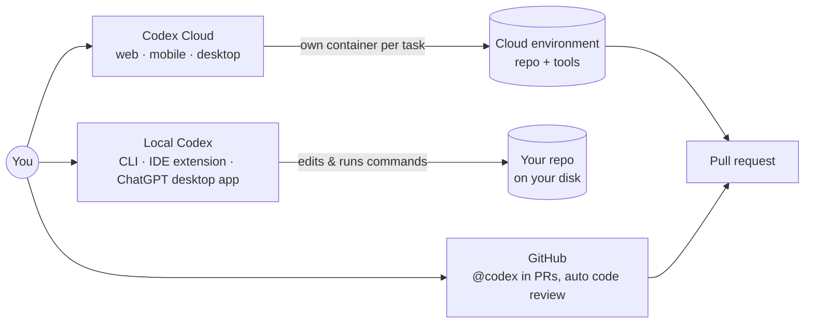
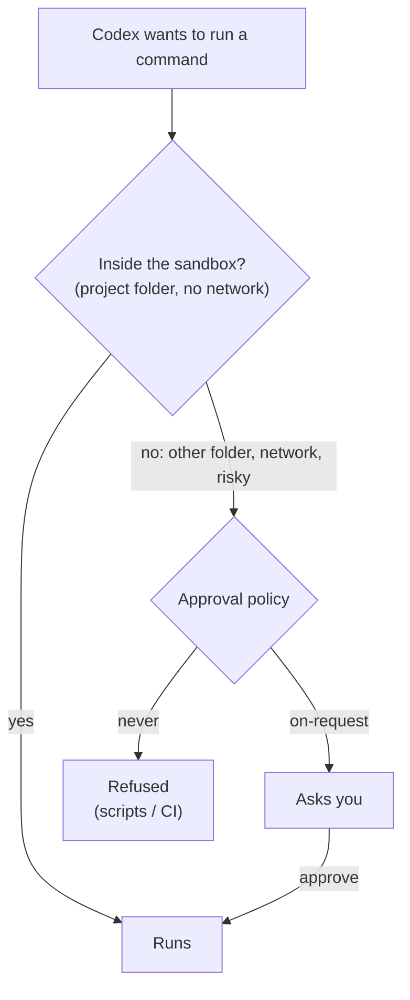
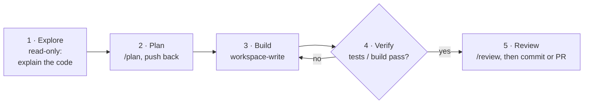
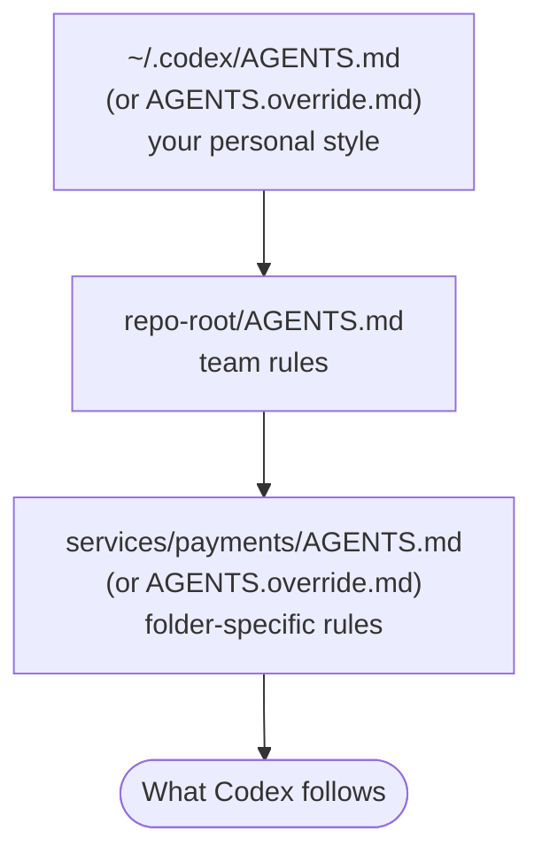
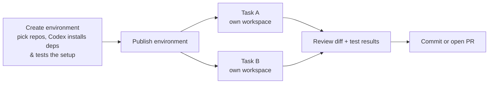
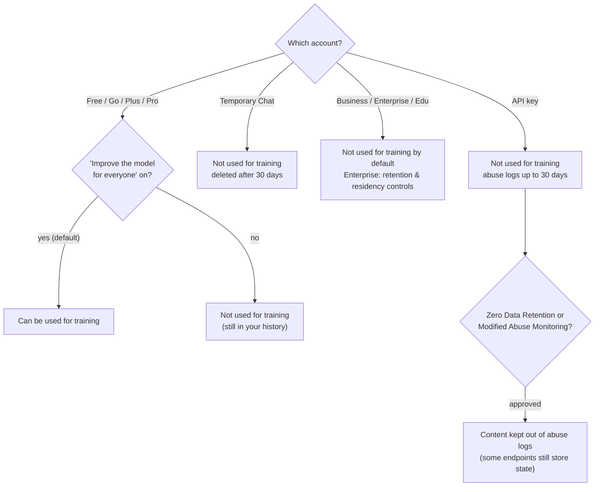

# OpenAI Codex Field Guide

**Getting real work out of OpenAI Codex, in plain English.** What Codex is, where it runs, how to keep it safe, the setup that pays off, prompts that work, and what OpenAI does with your data on each plan.

> Checked against OpenAI's Codex / ChatGPT docs on **3 October 2026**. OpenAI renames and moves things often (Codex now lives inside the ChatGPT apps next to "ChatGPT Work"); when in doubt, the docs win.
> Every section starts with an **In plain words** box. If that's all you read, you'll still be fine.
> Coming from Claude Code? See [the Claude guide](../claude/README.md) and the [comparison table](#codex-vs-claude-code-in-one-table) at the end.

## Contents

1. [The 1-minute map](#the-1-minute-map)
2. [Install and first run](#install-and-first-run)
3. [Sandbox and approvals](#sandbox-and-approvals-how-much-it-may-do)
4. [The working loop](#the-working-loop)
5. [AGENTS.md: teaching it once](#agentsmd-teaching-it-once)
6. [Skills, MCP, subagents, memories](#skills-mcp-subagents-memories)
7. [Codex Cloud, reviews and automation](#codex-cloud-reviews-and-automation)
8. [Prompts that work](#prompts-that-work)
9. [Command cheat sheet](#command-cheat-sheet)
10. [Plans and models](#plans-and-models)
11. [What happens to your data](#what-happens-to-your-data)
12. [Codex vs Claude Code](#codex-vs-claude-code-in-one-table)

---

## The 1-minute map

> **In plain words:** Codex is OpenAI's coding agent. It reads your repo, edits files, runs commands and opens pull requests. You can run it **on your machine** (terminal, IDE, desktop app) or hand tasks to it **in the cloud** and review the result later.



| Surface | Good for |
|---|---|
| **Codex CLI** (`codex`) | Working in your local repo from the terminal; scripting with `codex exec` |
| **IDE extension** (VS Code and forks) | Codex next to your editor, using your open files as context |
| **ChatGPT desktop app** (Codex / Work) | Projects, files, long-running work, worktrees, local or cloud from one place |
| **Codex Cloud** | Tasks that run while your laptop sleeps, each in its own container; review and open a PR |
| **GitHub** | `@codex` on issues and PRs, automatic code review |
| **Codex SDK / App Server** | Embedding Codex in your own tools |

---

## Install and first run

```bash
# macOS / Linux
curl -fsSL https://chatgpt.com/codex/install.sh | sh
# or with npm
npm install -g @openai/codex

cd your-project
codex            # sign in with your ChatGPT account (or an API key) on first run
```

Windows: `powershell -ExecutionPolicy ByPass -c "irm https://chatgpt.com/codex/install.ps1 | iex"` (native sandbox and PowerShell are supported).

**Two ways to sign in:**
- **ChatGPT account** (Plus, Pro, Business, Enterprise, Edu): uses your plan's included usage, unlocks cloud features (cloud tasks, GitHub review, Slack).
- **API key**: pay per token, good for CI and shared machines, **no cloud features**.

---

## Sandbox and approvals: how much it may do

> **In plain words:** Codex has two separate dials. The **sandbox** decides what it *can* touch (which folders, whether it can reach the internet). **Approvals** decide when it must *ask you first*. By default it can write only inside your project and has no network.



| Sandbox mode | What it can touch |
|---|---|
| `read-only` | Reads files, changes nothing |
| `workspace-write` *(default for git repos)* | Writes in the project folder and temp dirs; **no network** unless you allow it. `.git`, `.codex` and `.agents` stay read-only |
| `danger-full-access` | Everything. Only in a throwaway container or VM |

| Approval policy | Meaning |
|---|---|
| `on-request` *(default)* | Asks when it needs to leave the sandbox (other folders, network, risky commands) |
| `never` | Never asks; anything outside the sandbox fails. For scripts and CI |
| granular | Fine-grained: which kinds of requests prompt you |

What Codex picks on launch: in a **git repo** it suggests **Auto** (`workspace-write` + `on-request`); in a folder **without git** it starts `read-only`. Change it any time with `/permissions`.

```bash
codex --sandbox workspace-write --ask-for-approval on-request   # the normal setup
codex --sandbox read-only --ask-for-approval on-request         # just looking
```

```toml
# ~/.codex/config.toml
sandbox_mode    = "workspace-write"
approval_policy = "on-request"

[sandbox_workspace_write]
network_access = false        # turn on only when a task needs it
```

> ⚠️ **Good to know**
> - The old `approval_policy = "untrusted"` is **retired**. If it's still in a config file, Codex may refuse to start. Remove it.
> - Network access can go through a proxy with a domain **allowlist** (`deny` always beats `allow`; private/local addresses stay blocked unless you add them explicitly). Prefer an allowlist over "network on".
> - `--yolo` / full access turns the guard rails off. Container only.

---

## The working loop



1. **Explore** in read-only: "Explain how auth works here, list the key files. No changes."
2. **Plan** with `/plan`. Read it, push back.
3. **Build.** Let it work in the workspace.
4. **Verify.** Tell it exactly how success is proven: "run `pytest -q` until green", "the app must start without errors".
5. **Review** with `/review` (uncommitted changes or against a branch), then commit or open a PR.

> 💡 **Rule of thumb:** an agent that can't check its own work hands the checking to you. Always include the test or build command in the prompt or in AGENTS.md.

---

## AGENTS.md: teaching it once

> **In plain words:** `AGENTS.md` is a text file of standing instructions. Codex reads it before starting work. Put your build/test commands and house rules there, keep it short, and update it every time you correct the same thing twice.

```markdown
# AGENTS.md
## Commands
- Install: `pnpm install`
- Test: `pnpm test` (must pass before you finish)
- Lint: `pnpm lint --fix`

## Rules
- TypeScript strict; no `any`.
- Don't touch `migrations/` without asking.
- Small PRs: one concern per change.
```

**Where Codex looks (closest wins):**



- Global file `~/.codex/AGENTS.md`: how Codex talks to *you* (verbosity, review style).
- Repo files: team and codebase rules, checked into git. Nested folders can add or override (`AGENTS.override.md`).
- Total size is capped (32 KiB by default, `project_doc_max_bytes`). Another reason to keep it short.
- `/init` drafts an AGENTS.md for the current project.
- In a GitHub PR, comment `@codex add this to AGENTS.md` to turn review feedback into a rule.

**When to update it:** the same mistake twice → add a rule. It reads too many files → add "start in these folders". You leave the same PR comment twice → codify it. Back rules up with real enforcement (linters, pre-commit hooks, type checks).

---

## Skills, MCP, subagents, memories

| Piece | What it is | Use it when |
|---|---|---|
| **AGENTS.md** | Always-on instructions | House rules, commands |
| **Skills** | A folder with a `SKILL.md`: a reusable workflow or expertise, loaded when relevant | A procedure you'd otherwise paste again and again. (Replaces the deprecated "custom prompts".) |
| **MCP servers** | Connections to outside tools and data | Docs, databases, issue trackers, browsers |
| **Subagents** | Helpers with their own context; you can define custom agents | Splitting review / research / implementation |
| **Memories** | Context Codex carries forward from earlier work | Preferences and project facts it learned. Toggle per chat with `/memories` |

**Skills:** personal ones in `~/.agents/skills/`, team ones in `.agents/skills/` in the repo. Codex can pick a skill up by itself when your request matches it, or you call it explicitly with `$skill-name`. `$skill-installer <name>` installs published skills.

```markdown
<!-- .agents/skills/release-notes/SKILL.md -->
---
name: release-notes
description: Write release notes from merged PRs since the last tag. Use when asked for a changelog or release notes.
---
1. List merged PRs since the last tag (`gh pr list --state merged`).
2. Group as Features / Fixes / Internal; one user-facing line per PR.
```

**MCP** in `~/.codex/config.toml`:

```toml
[mcp_servers.openaiDeveloperDocs]
url = "https://developers.openai.com/mcp"

[mcp_servers.github]
command = "github-mcp-server"
args = ["stdio"]
```
`/mcp` shows what's connected. Treat every MCP server like software you install: it runs with your permissions.

> 🛑 **Prompt injection applies here too.** Anything Codex reads (issues, web pages, docs, dependency READMEs) can contain hidden instructions. Keep the default sandbox, keep network off or allowlisted, and don't give it production credentials.

---

## Codex Cloud, reviews and automation

> **In plain words:** in the cloud, each task gets its own container with your repo set up. You describe the task, close the laptop, come back to a diff with test results, and open a PR if you like it.



- **Environments:** set up once (repos, dependencies, tools), reused by every task. Configure **internet access** and **network secrets** (credentials only sent to allowed HTTPS hosts) per environment.
- **Start from anywhere:** web, mobile, desktop app, or `codex cloud` / `/cloud` from the CLI.
- **Code review:** automatic reviews on GitHub PRs, `@codex` mentions, or `/review` locally.
- **Scheduled tasks:** run checks on a schedule or on app events (for example a daily "what should we add to AGENTS.md?" check).
- **Scripts and CI:** `codex exec "…"` runs non-interactively (read-only sandbox by default; add `--sandbox workspace-write` when it should change files; `--json` for machine-readable output). Use an API key in CI.
- **Codex Security:** a plugin that scans for vulnerabilities and drafts fixes.
- **Safety pauses:** if OpenAI's monitoring flags a task, it pauses and shows findings before you can resume (on the CLI and with zero data retention, the task simply ends).

---

## Prompts that work

| Situation | Say this | Why it works |
|---|---|---|
| New codebase | *"Explain how a request flows from route to database. Point me to the 5 files that matter. Don't change anything."* | Keeps it in read mode. |
| Bug | *"/checkout returns 500 with an empty cart. Write a failing test first, fix it, then run the full suite."* | It has to prove the fix. |
| Feature | *"/plan Add Stripe subscriptions. Ask me questions until the plan has no gaps. No code yet."* | Questions surface hidden requirements. |
| Parallel review | *"Have one subagent map the affected code paths, one look for real risks, and one verify the framework APIs against the docs MCP."* | Splits the work, cross-checks claims. |
| Making it stick | *"You used npm again. Add a rule to AGENTS.md."* | Fixes the cause. |
| Cloud batch | *"For each failing test in CI run #123, start a separate cloud task with a fix and a PR."* | Parallel, reviewable chunks. |

---

## Command cheat sheet

| Command | Does |
|---|---|
| `codex` · `codex resume` | Start · continue a saved chat |
| `codex exec "…"` | Non-interactive run for scripts and CI |
| `codex cloud` | Start or list cloud tasks from the terminal |
| `/permissions` | Change sandbox and approvals |
| `/plan` | Toggle plan mode |
| `/review` | Review uncommitted changes or a branch |
| `/init` | Draft an AGENTS.md |
| `/model` · `/reasoning` | Switch model · set reasoning effort |
| `/compact` | Summarise the chat to free context |
| `/status` | Chat ID, context used, rate limits |
| `/fork` · `/side` | Copy the chat · quick side chat without derailing the main one |
| `/goal` | Keep working toward a goal |
| `/worktree` | Run the chat in a new git worktree |
| `/local` · `/cloud` | Move the chat between your machine and the cloud |
| `/mcp` · `/memories` | Connected servers · memory on/off for this chat |
| `/feedback` | Send feedback, optionally with logs |

(Exact availability differs slightly between the CLI, IDE extension and desktop app.)

---

## Plans and models

| Plan | Price (Oct 2026) | Codex |
|---|---|---|
| Free | $0 | Quick tasks with GPT-6 Luna in the desktop app (rolling out) |
| Go | $8/mo | Lightweight tasks, GPT-6 Luna |
| Plus | $20/mo | Web, CLI, IDE, iOS; cloud review and Slack; GPT-6.1 Sol and GPT-6 Luna |
| Pro | $100 / $200 / $500 per month | More usage; Astra Ultrafast on the $500 tier |
| Business | $20/user/mo annual ($25 monthly) | Shared workspace, SSO, **no training on business data by default** |
| Enterprise / Edu | Contact sales | SCIM, RBAC, audit logs, **data retention and residency controls** |
| API key | Pay per token | CLI / SDK / IDE only, no cloud features |

ChatGPT Work and Codex share the same usage pool.

**Models:** GPT-6.1 Sol is the main coding model on paid plans; GPT-6 Luna is the lighter one. **GPT-5.5 retires from ChatGPT and Codex on 14 October 2026** (not from the API): if a config, script or custom agent says `gpt-5.5`, switch it to `gpt-6-sol` / `gpt-6.1-sol` (paid) or `gpt-6-luna` (Free/Go). Set the default in `config.toml` with `model = "..."`, or per run with `-m`.

---

## What happens to your data

> **The short version:** on **personal ChatGPT plans** your chats can be used to improve OpenAI's models unless you switch off **"Improve the model for everyone"** (Settings → Data Controls). **Temporary Chats** aren't used for training and are deleted after 30 days. **Business, Enterprise, Edu and the API** aren't used for training by default. The API keeps abuse-monitoring logs for up to 30 days unless you qualify for zero data retention.



| Account | Used for training? | Kept for |
|---|---|---|
| Free / Go / Plus / Pro, setting **on** (default) | ⚠️ Yes | As long as it's in your history; deleted chats are removed from OpenAI's systems within 30 days (barring legal or security holds) |
| Free / Go / Plus / Pro, setting **off** | ✅ No | Same as above |
| Temporary Chat | ✅ No | Deleted after **30 days**; not in history, no memories |
| Business / Enterprise / Edu | ✅ No by default | Workspace settings; Enterprise/Edu add retention and data-residency controls |
| API (incl. Codex with an API key) | ✅ No (since March 2023, unless you opt in) | Abuse-monitoring logs up to **30 days**; zero data retention / modified abuse monitoring for approved orgs |

**The fine print, in normal words**
- **Codex with your ChatGPT login** runs under your ChatGPT account, so it follows that account's plan and Data Controls. If you code on a personal plan, check the training toggle.
- **Codex stores transcripts locally** under `~/.codex` (`history.jsonl`, `sessions/`). Set `history.persistence = "none"` in `config.toml` if you don't want that.
- **Cloud tasks** run on OpenAI's infrastructure with your repo cloned in. Network secrets are only sent to the hosts you allow.
- **Court orders can override deletion.** In 2025 a US court made OpenAI keep deleted ChatGPT and API output logs (NYT lawsuit). That ended on 26 September 2025 for new data. Logs already preserved stay preserved, with EEA, Swiss and UK users excluded. Lesson: "deleted" means "deleted unless a court says otherwise", for any US provider.
- **Feedback** (thumbs, `/feedback` with logs) shares that conversation with OpenAI. Don't send it on client work.

**So what should you do?**
1. Client or NDA code: use a **Business/Enterprise** workspace or an **API key**, not a personal plan. If you must use a personal plan, switch training **off**.
2. Keep secrets out of prompts and repos you hand to Codex. Use network secrets in cloud environments, never plain env vars in code.
3. Turn off local history on shared machines (`history.persistence = "none"`).
4. For GDPR: OpenAI offers a DPA for business plans and the API. List it as a processor (US) in your privacy notice; Enterprise/Edu can choose data residency.

---

## Codex vs Claude Code in one table

| | OpenAI Codex | Claude Code |
|---|---|---|
| Standing instructions | `AGENTS.md` (nested, `AGENTS.override.md`) | `CLAUDE.md` (also reads `AGENTS.md`) |
| Reusable workflows | Skills in `~/.agents/skills`, `.agents/skills`, call with `$name` | Skills in `~/.claude/skills`, `.claude/skills`, call with `/name` |
| Safety model | Sandbox (read-only / workspace-write / full) + approval policy | Permission modes (manual / acceptEdits / plan / auto / dontAsk / bypass) + optional Bash sandbox |
| Default | `workspace-write` + `on-request`, no network | Auto mode with a background safety classifier |
| Config | `~/.codex/config.toml` (TOML) | `~/.claude/settings.json` (JSON) |
| Cloud | Codex Cloud environments, per-task containers | Claude Code on the web, routines |
| Scripts / CI | `codex exec` | `claude -p` |
| Event hooks | Rules + enforcement via your own tooling | Hooks (PreToolUse, PostToolUse, …) |
| Training on personal plans | On by default, toggle off | Your choice at signup, toggle any time |

---

## Sources

All read on 3 October 2026.

- Codex docs: [Codex CLI](https://learn.chatgpt.com/docs/codex/cli) · [Agent approvals & security](https://learn.chatgpt.com/docs/agent-approvals-security) · [AGENTS.md](https://learn.chatgpt.com/docs/agent-configuration/agents-md) · [Customization](https://learn.chatgpt.com/docs/customization/overview) · [Build skills](https://learn.chatgpt.com/docs/build-skills) · [Codex Cloud](https://learn.chatgpt.com/docs/cloud) · [Models](https://learn.chatgpt.com/docs/models) · [Codex manual](https://learn.chatgpt.com/docs/codex-manual.md)
- API data use: [Your data](https://developers.openai.com/api/docs/guides/your-data)
- ChatGPT data controls: [Data Controls FAQ](https://help.openai.com/en/articles/7730893-chatgpt-temporary-chat-faq)
- NYT preservation order ending: [court-order explainer](https://www.llms-for-lawyers.com/confidentiality/nyt-v-openai-deleted-chatgpt-chats-lawyers/)
